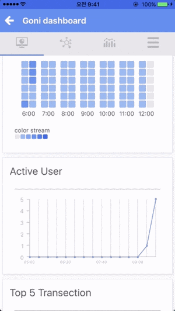
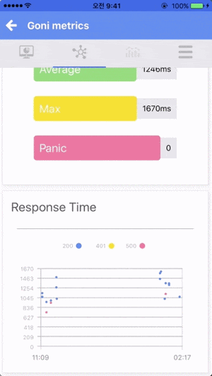
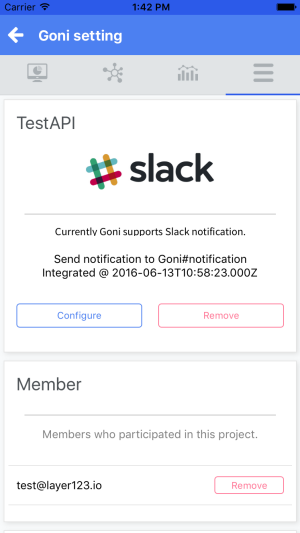

# goni-mobile
### Mobile simple chart application for goni

  


## Goni mobile Overview  

Dashboard | API Transaction | Metrics | Setting
----------|-----------------|---------|--------
 |  |  | 

#### 1. Goni Dashboard Section  
* By clicking system status heatmap, which is drawn by instance's CPU status
you can check Active User and Top 5 Transaction 

#### 2. Goni API Transaction Section  
* You can check API Transaction (min, mean, max time and panic count)
* And check Response Time dot graph

#### 3. Goni Metrics Section(Warning)
* You can check Expvar Metric (Runtime Metric not yet)
* In this section, we draw a graph of the number of the number at a time. We know degradation of performance and have a solution. This issue be fixed in the next minor version. Please do not use if possible.

#### 4. Goni Setting Section  
* You can check slack notifiaction setting and your project members
* If you want to logout, check this section


### We need react-native-cli
Install with the following command:
```bash
npm install -g react-native-cli
npm install -g rnpm
```

### iOS build
Until the library is modified, it is impossible to try to build.  
But if you want to build it, fix 'react-native-vs-chart' bug [here](https://github.com/bretdabaker/react-native-vs-charts/pull/3).  
may be it will work :D
```bash
npm install
rnpm link
react-native run-ios
```

###TODO
* StyleSheet refactoring and make global style
* Fix issue for Metric section
 * just one graph rendering and user chose typeof metric
* Make therd part lib for chart
  * 'react-native-vs-chart' is not updated. so, I will make new lib for chart (Use only the view style sheet)
  * And add 'heatmap chart' in system status, 'pie chart' in runtime section etc..
